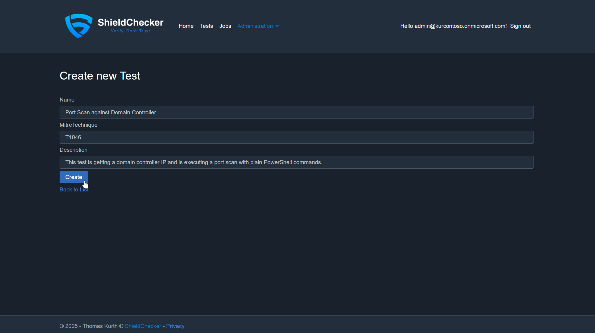
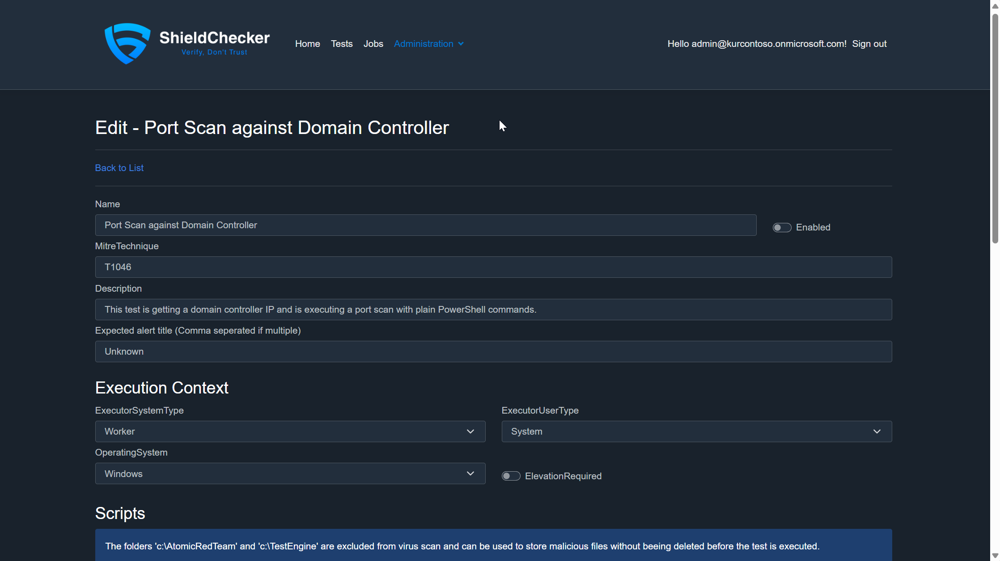
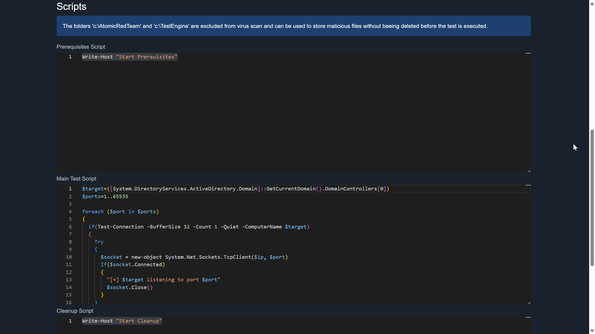
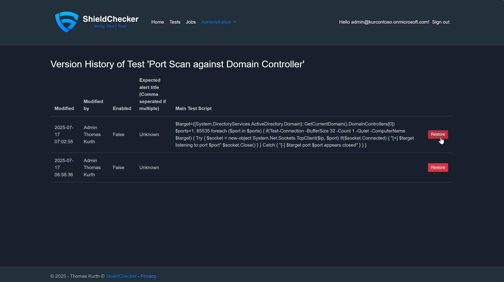

# Manage Tests

## Create Test

1. Create a first test starts with navigating to the Tests section of the ShieldChecker Portal. Above the list you can click on "New Test".
    

2. On the first page you have to specify some metadata of the test. In my example I use the following:
    - *Name:* Port Scan against Domain Controller<br />_It's recommended to think about a naming strategy in your environment. It's possible to describe what the test is doing or if you create one detection per Defender Custom Detection then you can also use the title of the detection._
    - *MITRE Technique:* T1046
    - *Description:* This test is getting a domain controller IP and is executing a port scan with plain PowerShell commands.

    

3. As soon the metadata is saved you will see the full edit Test page. 

    - *Expected alert title (Comma seperated if multiple):* Unknwon<br />If you want to test a specific detection, then it's recommended that you specify the specific Alert title only. If you want to test in general then you can specify all alert titles which are thrown after a first run. 
    - *Prerequisites/Main/CLeanup Script:* <br /> 
    ```powershell
$target=([System.DirectoryServices.ActiveDirectory.Domain]::GetCurrentDomain().DomainControllers[0])
$ports=1..65535

foreach ($port in $ports)
{
  if(Test-Connection -BufferSize 32 -Count 1 -Quiet -ComputerName $target)
  {
    Try
    {
      $socket = new-object System.Net.Sockets.TcpClient($ip, $port)
      If($socket.Connected)
      {
        "[+] $target listening to port $port"
        $socket.Close() 
      }
    }
    Catch
    {
      "[-] $target port $port appears closed"
    }
  }
}
    ```
    - *OperatingSystem:* Windows <br /> You can choose between Windows and Linux. The WIndows System is joined automatically to the domain.
    - *ExecutorSystemType:* Worker <br />You can choose between Worker and Domain Controller. In case you choose Worker a dedicated VM is created and the test executed on it. When choosing the Domain Controller as executer then the test is executed on the DC and the system is waiting until the timeout is reached or an Alert is detected. When choosing worker then multiple parallle workers can be spin up, depending on your configuration or Azure limits (CPU Cores).
    - *ExecutorUserType:" It's possible to run the test in different user context. The default is system which has full controll over the system.
    When finished click on *Safe and Close*. Test the execution by following the [execute test manual](/docs/RunAndScheduleTests.md).

    
    
    


## Edit Tests

1. Edit a test starts with navigating to the Tests section of the ShieldChecker Portal.
2. Search for your test by using the search bar above the test list.
    

## Restore old Test Version

Each time you edit a test a new revision is created and you have the ability to restore an old version.

1. To restore and old version of a test navigate to the Tests section of the ShieldChecker Portal.
2. Search for your test by using the search bar above the test list and click on the history icon.
    
3. The Histroy page is shown and you can restore an old version. When selecting restore the actual test is overwritten with the old values.
    
