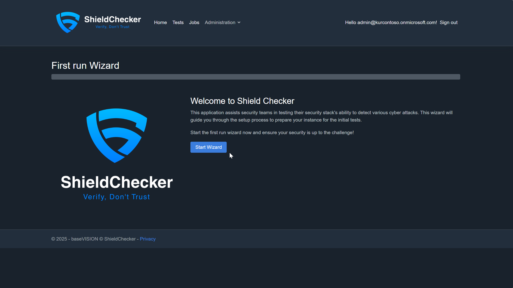
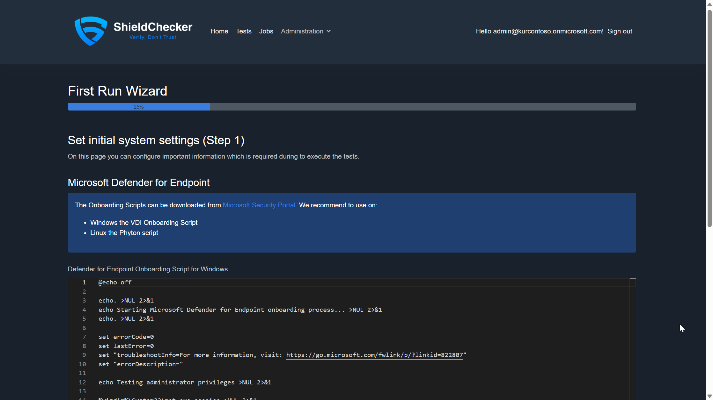
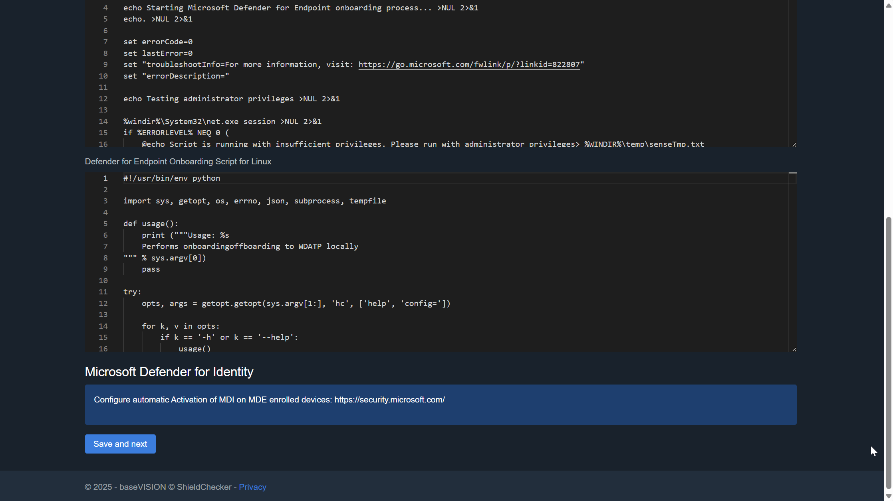
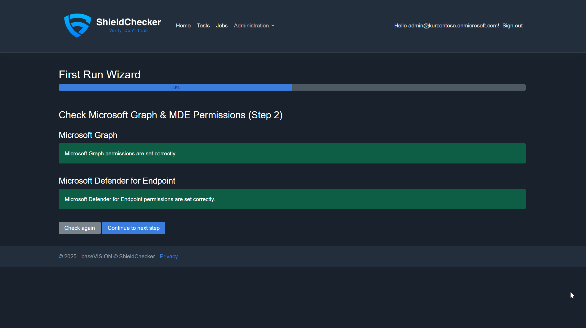
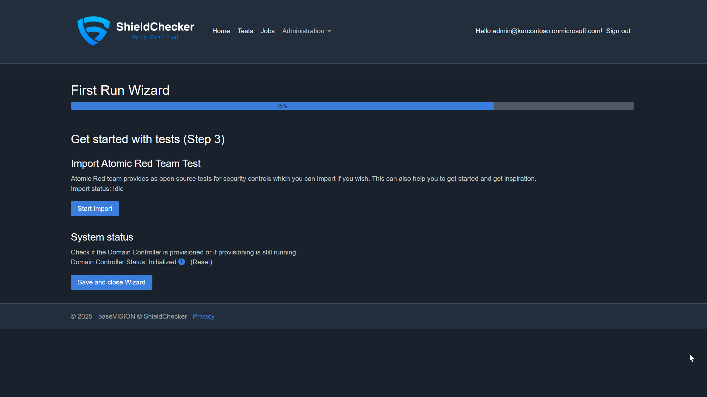

# Deployment

## Requirements to run the Installation

* Install the latest version of Azure PowerShell, including the Bicep CLI.
* Dedicated test Tenant
* Single Microsoft Defender XDR License like E5/A5.
* Azure Subscription
* PowerShell Core 7+
* Azure CLI
* Bicep CLI

## Preparation

### Create DB Admin Group in Entra ID

1. Create a security group in Entra ID.
2. Add your user account to this group. If using DevOps, add the Service Principal of the pipeline instead.
3. Note the Object ID and the name of the group for later use.


## Deployment Steps

### Download latest version

1. Download latest version from [Release page](https://github.com/ThomasKur/UseCase.ShieldChecker/releases).
2. Extract the content
3. Navigate to the newly extracted folder in the PowerShell session which you have

### Log in to Azure PowerShell

1. Before running any deployment scripts, ensure you are logged into Azure PowerShell and have selected the correct subscription:

```powershell
Connect-AzAccount
Select-AzSubscription -SubscriptionId "<YourSubscriptionId>"
```

### Initial Deployment and Updates


1. Run the following PowerShell script to perform the initial deployment. Replace the placeholders with the appropriate values for your environment. You will be asked for the Admin Password automatically as soon you execute the comand:

```powershell
./Invoke-Deploy.ps1 -SQLAdminGroupName "<SQLAdminGroupName>" `
                    -ApplicationName "<ApplicationName>" `
                    -TestDomainFQDN "<TestDomainFQDN>" `
                    -ResourceGroupName "<ResourceGroupName>" `
                    -adminPw (Read-Host -Prompt "Enter Password" -AsSecureString) `
                    -CreateRessourceGroupIfNotExistsLocation "<Location>"
```

This script will deploy all required resources, including the web application and database. The process takes 15 to 30 minutes. Document all used parameters so you can update it in the future to uptdate to a newer version without issues. When the script finished you can browse to the newly created webapp and start the first run wizard to complete the setup. 

### First Run Wizard

After the deployment is complete, navigate to your newly created web application URL to start the First Run Wizard. This wizard will guide you through the initial configuration of ShieldChecker, including MDE setup and test imports.

1. Welcome and Initial Configuration


The welcome screen provides an overview of the setup process. Click "Start Wizard" to begin the configuration.

2. MDE Configuration



To be able to deploy worker devices with MDE enabled it's important that the you add the onboarding scripts from your environment. They should look like the one in the Screenshots.

3. Permission Setup



In normal cases the permisions should be granted correctly during setup. In special cases not and therfore this step is checking it.

4. Test Import Options



To simplify the initial setup for you it's possible to import the tests from test framework tools. At the begining this is only Atomic Red Team test.

You should also see that the Domain Controller Status is Initialized or that the setup is still running. 

Once you have first tests created or imported and the Domain Controller Status switches to Initialized you'll be able to start running security tests to validate your Microsoft Defender XDR detections.

## Special Options

### Updating an Existing Deployment 
If there is a new version with changes only to the web application and database, run the following PowerShell script instead to speed up the deployment. If you are unsure, then just use the initial used command 'Invoke-Deploy.ps1'. Replace the placeholders with the appropriate values for your environment:

```powershell
./Invoke-UpdateWebAppAndSql.ps1 -ResourceGroupName "<ResourceGroupName>" `
                                -sqlServerName "<SQLServerName>" `
                                -sqlServerDatabaseName "<SQLServerDatabaseName>" `
                                -webAppName "<WebAppName>" `
                                -TestDomainFQDN "<TestDomainFQDN>"
```

This will update the web application and database without redeploying other resources.

