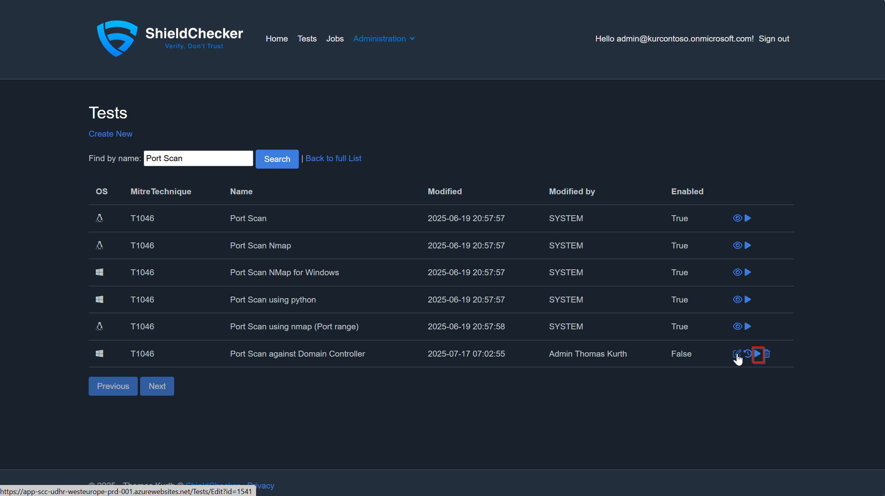
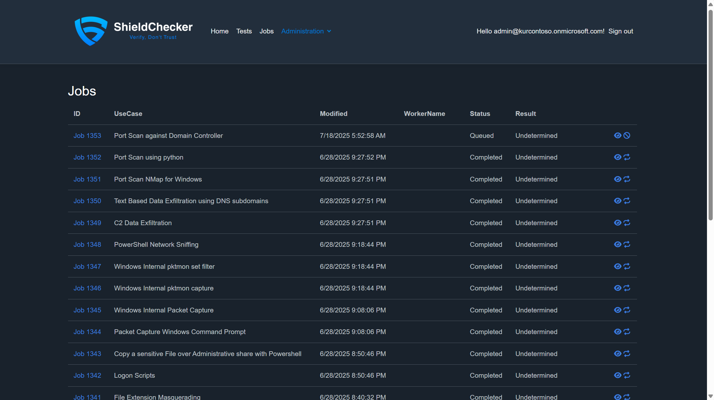
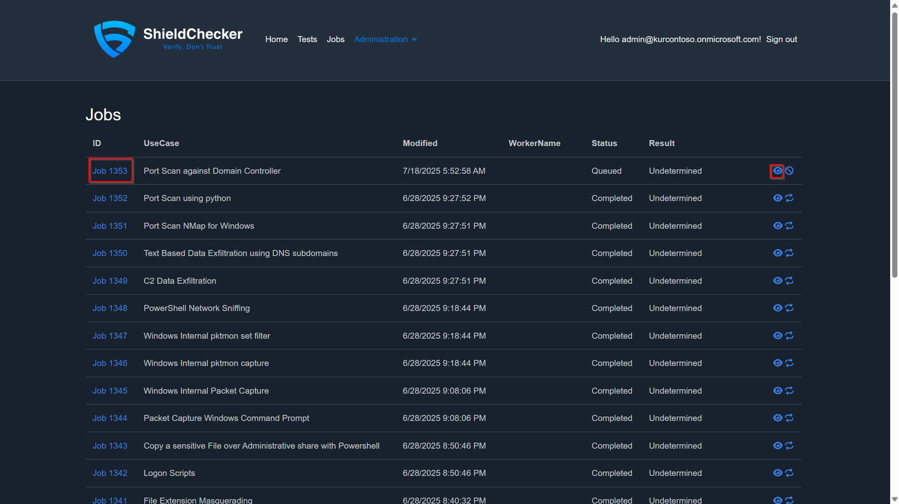
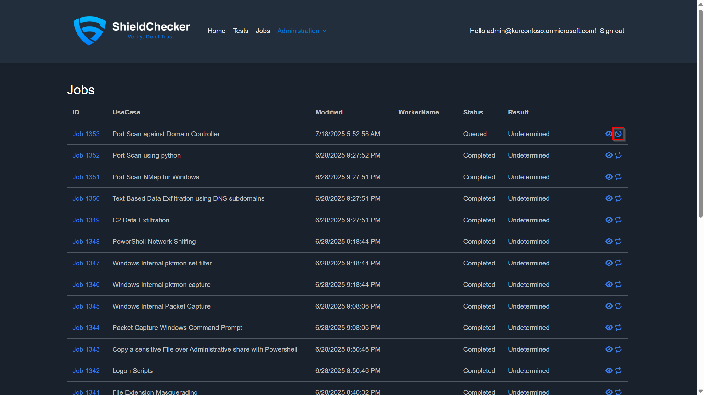
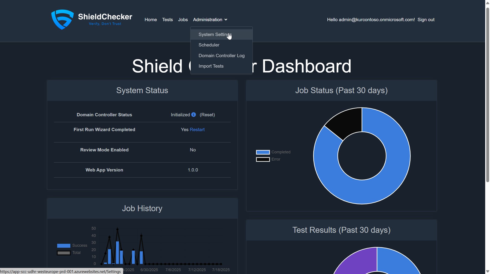
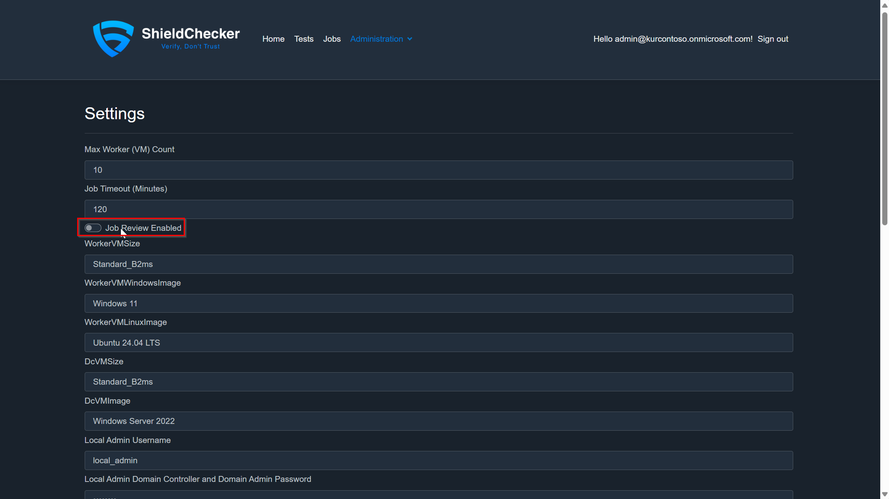

# Test Execution and Scheduling Guide

This cpage covers executing security tests, managing job lifecycles, and configuring automated scheduling in ShieldChecker to validate Microsoft Defender XDR detections.

## Overview

ShieldChecker's test execution system provides:
- **On-demand test execution** for immediate validation
- **Automated scheduling** for regular security assessments
- **Comprehensive job monitoring** with detailed progress tracking
- **Review mode capabilities** for troubleshooting and analysis

The job scheduler operates on a **15-minute cycle**, continuously monitoring and updating job progress while initiating new actions as needed.

## Single Test Execution

### Executing Individual Tests

Running individual tests provides immediate feedback on specific detection capabilities.

#### Step 1: Navigate to Test Selection

1. Access the **Tests page** in the ShieldChecker portal
2. Use the **search functionality** to locate your specific test

#### Step 2: Initiate Test Execution

1. **Click the start icon** next to your selected test
2. **Monitor job creation** - you'll be redirected to the jobs page

#### Test Execution Process

When you start a test, ShieldChecker:
1. **Queues the job** in the execution pipeline
2. **Provisions worker VM** (if using Worker execution type)
3. **Configures MDE onboarding** for the test environment
4. **Executes the test script** with specified parameters
5. **Monitors for detections** within the timeout period
6. **Generates results** and cleans up resources

### Job Restart Capabilities

Sometimes tests fail due to environmental issues, configuration changes, or temporary problems. The restart functionality allows you to re-execute jobs without recreating them.

#### Restart Process

1. Navigate to the **Jobs page**
2. **Locate the failed or completed job** you want to restart
3. **Click the rerun button** in the job actions column

**Important Notes:**
- Restarting preserves original job parameters
- New worker VMs are provisioned for restart executions
- Previous execution logs remain available for comparison

## Automated Test Scheduling

The Auto Scheduler provides automation capabilities for running security tests on regular intervals, ensuring continuous validation of your security controls.

### Scheduler Configuration Options

#### Basic Scheduler Settings

**Name:** Descriptive identifier for the schedule
- Use clear, meaningful names for easy identification
- Include purpose and frequency in the name (e.g., "Weekly-Critical-Tests")

**Status:** Enable/Disable toggle for schedule control
- **Enabled:** Schedule actively creates and executes jobs
- **Disabled:** Schedule is paused but configuration is preserved
- Useful for temporary suspension during maintenance windows

**Next Execution:** Automated scheduling timestamp
- **Automatically updated** by the scheduler after each execution
- **Initial configuration:** Set to past date for immediate execution
- **Planning tool:** Helps coordinate multiple schedules

#### Execution Frequency Options

**AutoSchedule Type:** Defines the recurring execution pattern
- **Daily:** Execute every 24 hours
- **Weekly:** Execute once per week on the specified day
- **Monthly:** Execute on the same date each month
- **Quarterly:** Execute every three months

#### Test Selection and Filtering

**Maximum Tests Per Run:** Resource management control
- **Purpose:** Prevents excessive job creation from overly broad filters
- **Recommended:** Start with 20 tests during initial configuration
- **Production:** Adjust based on your resource capacity and requirements

**Operating System Filter:** Platform-specific test execution to separate schedules for different platforms or in case you have one not in us.
- **Windows:** Execute only Windows-based security tests
- **Linux:** Execute only Linux-based security tests

**Execution History Filter:** Intelligence-based test selection
- **Recent Success Filter:** Exclude tests that passed within specified timeframe
- **Failed Test Priority:** Focus on tests that previously failed detections

**Specific Test Selection:** Curated test execution
- **High-Priority Tests:** Select critical security validations for frequent execution

### Advanced Filtering (Planned Features)

> **Note:** Additional filtering capabilities are planned for future releases:
> - **MITRE ATT&CK Technique filtering**
> - **Test category and tag-based selection**
> - **Custom metadata filtering**
> - **Risk-based prioritization**

## Job Management and Monitoring

### Comprehensive Job Progress Monitoring

Effective job monitoring is crucial for understanding test execution success and identifying issues that may affect detection validation.

#### Accessing Job Details

1. **Navigate to the Jobs page** in the ShieldChecker portal
2. **Use search and filter capabilities** to locate specific jobs

3. Click on the **Job ID** or **view icon** to access comprehensive job details:

### Job Cancellation

Sometimes it's necessary to cancel running jobs due to operational requirements or detected issues.

1. **Navigate to the Jobs page**
2. **Locate the target job** using search functionality
3. **Click the cancel icon** to initiate cancellation

**Cancellation Effects:**
- **Resource cleanup** including VM deprovisioning
- **Partial results preservation** for analysis

### Review Mode for Advanced Troubleshooting

Review Mode provides deep troubleshooting capabilities by maintaining worker VMs after test completion, enabling direct access for investigation and analysis.

#### Review Mode Overview

**Default Behavior:**
- Tests that exceed the **2-hour timeout** without generating expected detections are marked as **Failed**
- Worker VMs are **automatically deprovisioned** to minimize costs
- **Limited troubleshooting** capability for failed tests only based on collected status logs in [Job Details](#accessing-job-details)

**Review Mode Benefits:**
- **Extended VM lifetime** for investigation
- **RDP access** to worker machines (Including to Linux ;))
- **Public IP assignment** for external connectivity

#### Enabling Review Mode

**Step 1: Access Settings**
Navigate to the Settings page through the main menu:

**Step 2: Configure Review Mode**
Toggle the Review Mode option and save settings:

#### Review Mode Operations

**When Review Mode is Enabled:**
1. **Failed jobs remain accessible** through RDP connections
2. **Automatic RDP file generation** for easy VM access
3. **Public IP assignment** for external connectivity
4. **Unlimited timeout period** for investigation which increases costs and blocks the job queue by consuming one of the execution slots.
5. **When the review Status is reached** then a dedicated Review Options is available, allowing you to document the review findings and set manually the Job Result.

## Job Status and Results Reference

### Job Status Definitions

Understanding job statuses is essential for monitoring test execution and identifying operational issues.

| Status | Description | Action Required |
|--------|-------------|-----------------|
| **Queued** | Job is waiting for available execution resources | Monitor queue position and resource availability |
| **WaitingForMDE** | Worker VM is being configured with Microsoft Defender for Endpoint and is waiting until the VM object is found in MDE (Onboarding successfull) | Verify MDE onboarding configuration and connectivity |
| **WaitingForDetection** | Test script completed, system monitoring for security alerts | Monitor detection systems for expected alerts |
| **ReviewPending** | Job exceeded timeout, awaiting manual review (if Review Mode enabled) | Access VM via RDP for troubleshooting or mark as reviewed |
| **ReviewDone** | Manual review completed, job marked for finalization | System will process final results and cleanup resources |
| **Completed** | Job successfully finished with all expected outcomes | Review results and detection analysis |
| **Canceled** | Job manually terminated before completion | Investigate cancellation reason if unexpected |
| **Error** | Job failed due to system error or configuration issue | Review error logs and troubleshoot underlying issues |
| **AzureSpotEvicted** | Azure Spot VM was reclaimed due to capacity or pricing (STatus for the Future) | Consider using standard VMs or restart job |

### Job Result Classifications

Job results provide insight into detection effectiveness and test success.

| Result | Description | Interpretation |
|--------|-------------|----------------|
| **Success** | Test executed successfully and generated expected detections | Security controls are functioning correctly |
| **SuccessWithOtherDetection** | Test succeeded and generated alerts, but not the one specified in the Test definition | Review additional detections for false positives and add these titles to the Test definition |
| **Failed** | Test did not generate expected detections within timeout period | Investigate detection rules, test configuration. CHeck Timeline in MDE or Enable [Review Mode](#review-mode-overview).  |
| **Undetermined** | Test has not yet finished | Wait until the Job execution finishes |

### Troubleshooting Common Status Issues

#### Jobs Stuck in "Queued"
**Possible Causes:**
- Azure resource quota limitations
- High job volume exceeding system capacity
- Referenced Test is not Enabled.

#### Jobs Failing at "WaitingForMDE"
**Possible Causes:**
- Incorrect MDE onboarding script configuration
- Microsoft Defender for Endpoint service issues

#### Extended "WaitingForDetection" Status
**Possible Causes:**
- Detection rules not properly configured
- Test script not generating expected indicators
- Microsoft Defender XDR processing delays

## Support and Additional Resources

### Documentation Links
- [Contents](Documentation.md) - Documentation Index

### Getting Help - Community Support
- [GitHub Issues](https://github.com/ThomasKur/UseCase.ShieldChecker/issues) - Report bugs and request features
- [Project Homepage](https://www.shieldchecker.ch) - Latest news and updates

> **Note:** ShieldChecker is a community-driven project maintained as a hobby. While we strive to help, there are no guaranteed response times or support SLAs.
