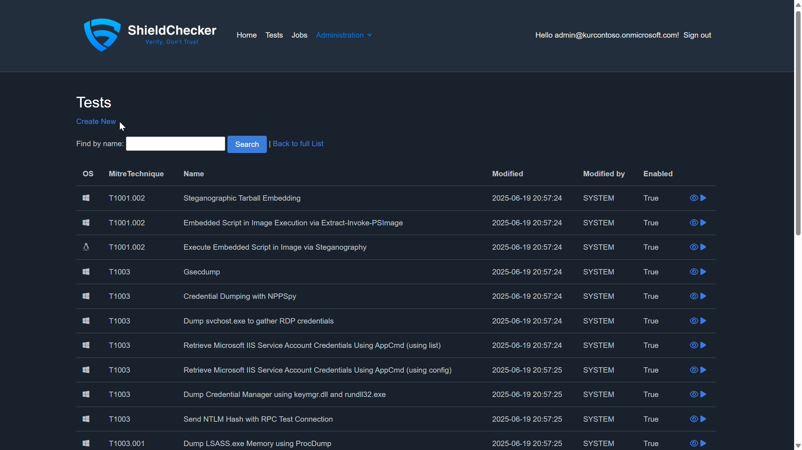
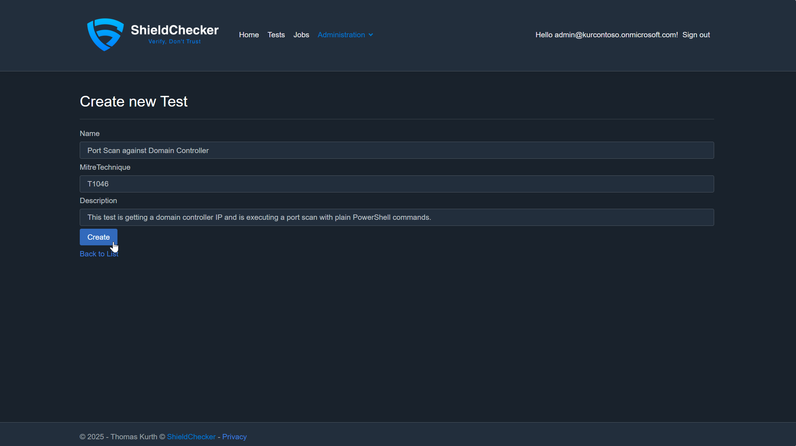
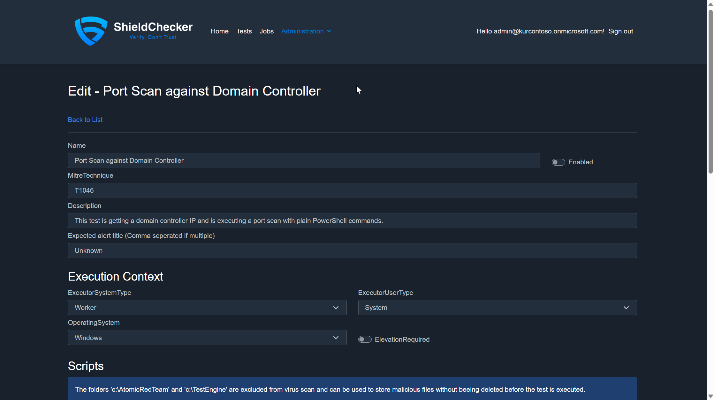
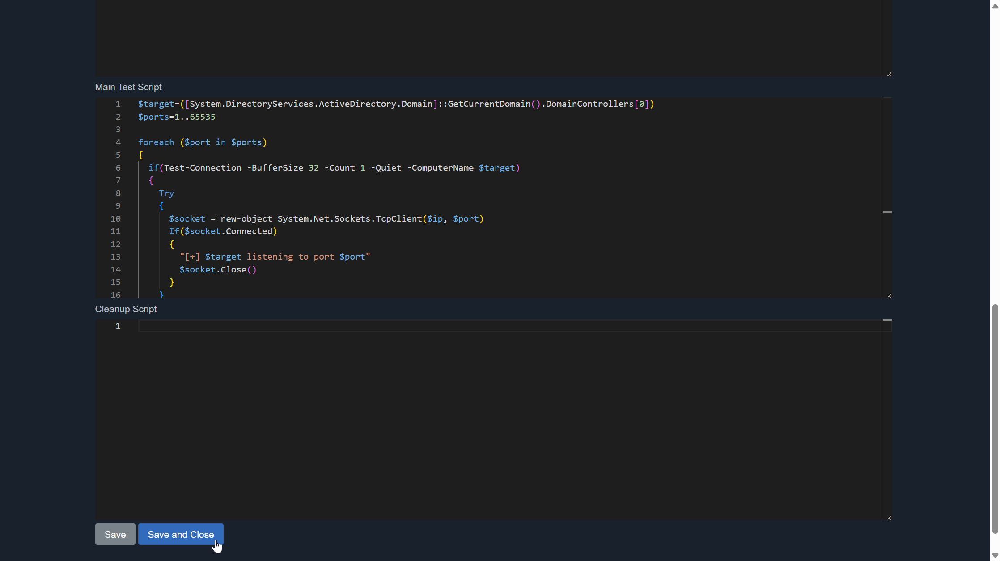
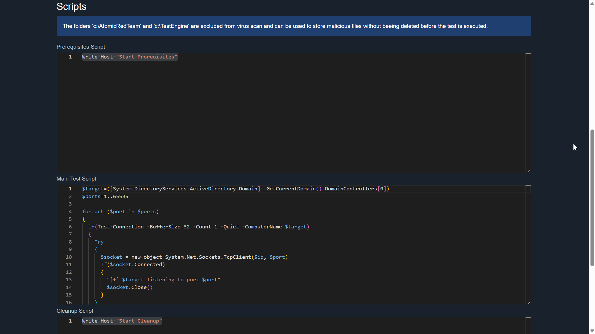
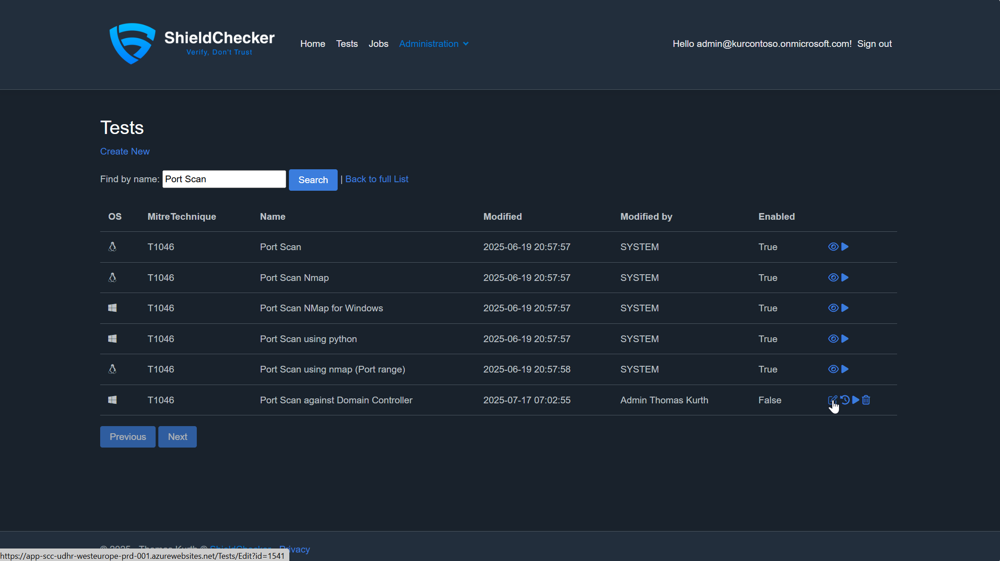
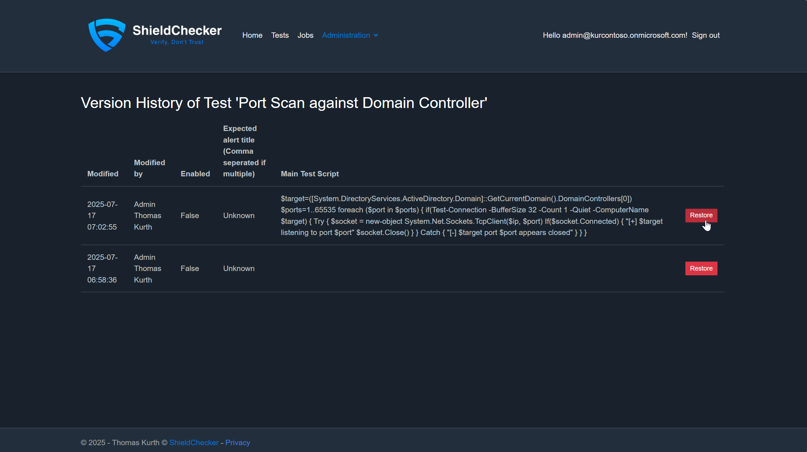

# Test Management Guide

This guide covers creating, editing, and managing security tests in ShieldChecker to validate Microsoft Defender XDR detections.

## Overview

ShieldChecker tests are designed to:
- Execute real security scenarios against your test environment
- Validate that Microsoft Defender XDR detections are working correctly
- Provide comprehensive coverage across different attack techniques
- Support both Windows and Linux environments

## Creating a New Test

### Step 1: Navigate to Test Creation

1. Access the Tests section of the ShieldChecker Portal
2. Click on "New Test" above the test list to begin creating a new test

    

### Step 2: Configure Test Metadata

On the first page, specify the essential metadata for your test. Consider the following example configuration:**Test Metadata Fields:**
- **Name:** Port Scan against Domain Controller  
  *Best Practice: Develop a consistent naming strategy. Use descriptive names that clearly indicate the test's purpose, or align with your custom detection titles.*
  
- **MITRE Technique:** T1046 (Network Service Discovery)  
  *Best Practice: Always map tests to relevant MITRE ATT&CK techniques for better categorization and reporting.*
  
- **Description:** This test performs network reconnaissance by executing a port scan against the domain controller using PowerShell commands to validate network discovery detection capabilities.

    

### Step 3: Configure Test Execution Settings

After saving the metadata, you'll access the complete test configuration page with advanced settings:
    
    
    

#### Detection Configuration
- **Expected Alert Title (Comma separated if multiple):** Unknown  
  *Configure this field based on your testing strategy:*
  - For specific detection testing: Specify exact alert titles you expect
  - For general testing: Use "Unknown" initially, then update after first execution with actual alert titles generated

#### Environment Configuration
- **Operating System:** Windows | Linux  
  *Select the target OS for test execution. Windows systems are automatically domain-joined.*

- **Executor System Type:** Worker | Domain Controller  
  - **Worker:** Creates dedicated VMs for test execution, allows parallel execution
  - **Domain Controller:** Executes tests directly on the DC with timeout-based completion

- **Executor User Type:** System | Local Administrator | Domain Administrator | Domain User

#### Test Scripts Configuration

Configure the three script phases for comprehensive test execution:

**Prerequisites Script:** Setup and preparation code  
**Main Script:** Core test execution logic  
**Cleanup Script:** Post-test cleanup and restoration

### Step 4: Example Test Script

Here's a complete example of a port scanning test whch can be used as main script:

```powershell
# Prerequisites Script (if needed)
# Setup any required dependencies or configurations

# Main Script - Port Scan Test
$target = ([System.DirectoryServices.ActiveDirectory.Domain]::GetCurrentDomain().DomainControllers[0])
$ports = 1..1024  # Scanning first 1024 ports for faster execution

Write-Host "Starting port scan against: $target"

foreach ($port in $ports) {
    if (Test-Connection -BufferSize 32 -Count 1 -Quiet -ComputerName $target) {
        try {
            $socket = New-Object System.Net.Sockets.TcpClient($target, $port)
            if ($socket.Connected) {
                Write-Host "[+] $target listening on port $port" -ForegroundColor Green
                $socket.Close()
            }
        }
        catch {
            Write-Host "[-] $target port $port appears closed" -ForegroundColor Red
        }
    }
}

Write-Host "Port scan completed"

```

### Step 5: Save and Validate

1. Check if you marked the test as Enabled
2. Click "Save and Close" to complete test creation
3. Test the execution by following the [Run and Schedule Tests Guide](ManageJobs.md)

## Managing Existing Tests

### Editing Tests

1. Navigate to the Tests section in the ShieldChecker Portal
2. Use the search bar to locate your specific test
3. Click on the test name to open the edit interface

    

### Search and Filter Options

- **Search by Name:** Use the search bar for quick test location

## Version Management and History

### Restoring Previous Test Versions

ShieldChecker automatically creates revisions each time you edit a test, providing complete version history:

1. Navigate to the Tests section
2. Locate your test using the search functionality  
3. Click on the history icon next to the test name

    

4. Review available versions and select the desired revision to restore

    

**Important:** Restoring a previous version will overwrite the current test configuration with the selected historical version.

## Best Practices for Test Development

### Naming Conventions
- Use descriptive, consistent naming patterns
- Include MITRE technique IDs when applicable
- Consider organizational naming standards

### Script Development
- Keep scripts focused on single techniques
- Include proper error handling
- Add logging for debugging purposes
- Test scripts in isolation before deployment

### Detection Validation
- Start with "Unknown" alert titles for new tests
- Update expected alerts after initial execution
- Regularly review and update detection expectations
- Validate alerts match actual security events

### Environment Considerations
- Use Worker VMs for potentially disruptive tests
- Reserve Domain Controller execution for specific scenarios
- Consider resource limitations and parallel execution limits in Azure Subscription
- Plan for cleanup and state restoration, especially on Domain Controller

## Troubleshooting Common Issues

### Test Execution Failures
- Verify script syntax and PowerShell compatibility
- Check user permissions for the selected executor type
- Validate network connectivity and domain dependencies

## Support and Additional Resources

### Documentation Links
- [Contents](Documentation.md) - Documentation Index

### Getting Help - Community Support
- [GitHub Issues](https://github.com/ThomasKur/UseCase.ShieldChecker/issues) - Report bugs and request features
- [Project Homepage](https://www.shieldchecker.ch) - Latest news and updates

> **Note:** ShieldChecker is a community-driven project maintained as a hobby. While we strive to help, there are no guaranteed response times or support SLAs.
