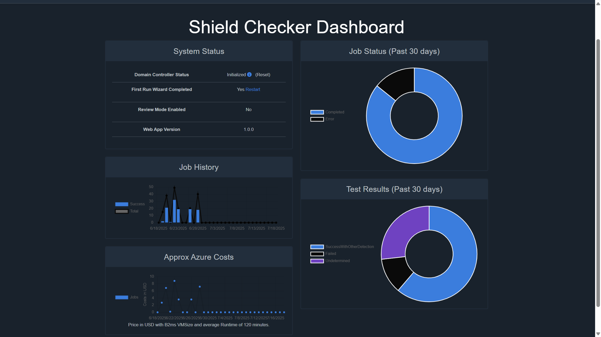

# ShieldChecker Reporting and Analytics

This guide provides comprehensive information about ShieldChecker's reporting capabilities, dashboard insights, and advanced analytics options for monitoring your security testing environment.

## Overview

ShieldChecker provides multiple layers of reporting to help you:
- **Monitor system health** and operational status
- **Track test execution** performance and trends
- **Manage costs** and optimize resource utilization
- **Generate compliance reports** for security assessments

## Main Dashboard

The ShieldChecker dashboard serves as your central command center, providing real-time insights into system status, test execution metrics, and operational health.



The system status panel provides critical information about your ShieldChecker environment:

#### Domain Controller Status
- **Initialized:** Domain controller is fully operational and ready for test execution
- **Initializing:** Domain controller deployment or configuration in progress
- **Error State:** Issues detected with domain controller - reset option available
- **Reset Function:** Completely removes and redeploys the domain controller VM

#### First Run Wizard Status
- **Completed:** Initial configuration finished successfully
- **Pending:** First Run Wizard needs to be executed
- **Re-run Option:** Access wizard again for reconfiguration if needed

#### Review Mode Status
- **Enabled/Disabled:** Controls RDP access to worker VMs for troubleshooting
- **Purpose:** Allows direct access to VMs when test executions fail unexpectedly
- **Security Note:** Should be disabled in production environments
- **Reference:** See [Review Mode Documentation](ManageJobs.md#review-mode-overview)

#### Web Application Version
- **Current Version:** Displays installed ShieldChecker version
- **Update Indicator:** Shows if newer versions are available
- **Deployment History:** Links to changelog and update procedures

### Operational Metrics (Past 30 Days)

#### Job Status Distribution
Provides comprehensive overview of test execution pipeline health.

#### Test Results Summary
Analyzes detection effectiveness across all executed tests.

#### Job History Trends
Historical analysis presented in histogram format help to detect trends in detection coverage in early stages.

#### Approximate Azure Costs
Cost monitoring and optimization insights:

- **Worker VM Costs:** Estimated expenses based on test execution time only.
- **Assumption Model:** Maximum 120-minute execution time per test
- **Detailed Analysis:** For comprehensive reporting we recommend leveraging [Azure Cost Management](https://learn.microsoft.com/en-us/azure/cost-management-billing/).

## Advanced Reporting with Power BI

### Database Integration

For organizations requiring sophisticated analytics and custom reporting, ShieldChecker supports direct database integration with Power BI and other business intelligence tools.

#### Prerequisites
1. **SQL Database Access:** [Configure firewall](https://learn.microsoft.com/en-us/azure/azure-sql/database/firewall-create-server-level-portal-quickstart?view=azuresql) rules to allow connection from your IP.
    - Note: This setting may be reset during ShieldChecker updates
2. **Authentication Setup:** Use Entra ID (Azure AD) authentication for secure access
    - Create Entra ID security group for reporting users
    - SQL Authentication is disabled for security - use Entra ID only
3. **User Permissions:** Grant appropriate read-only access to reporting users
    - Grant `db_datareader` role to the security group
```sql
DECLARE @user VARCHAR(64) = 'sg-SC-ReportingUser'; -- Group: Displayname, User: Princpal Name
IF NOT EXISTS(SELECT * FROM sys.database_principals WHERE [name] = @user)
BEGIN
    CREATE USER @user FROM EXTERNAL PROVIDER;
END;
ALTER ROLE db_datareader ADD MEMBER @user; 
GO
```

4. **Power BI Configuration**
    - Use DirectQuery or Import mode based on data volume requirements
    - Configure scheduled refresh for up-to-date reporting

## Support and Additional Resources

### Documentation Links
- [Contents](Documentation.md) - Documentation Index

### Getting Help - Community Support
- [GitHub Issues](https://github.com/ThomasKur/UseCase.ShieldChecker/issues) - Report bugs and request features
- [Project Homepage](https://www.shieldchecker.ch) - Latest news and updates

> **Note:** ShieldChecker is a community-driven project maintained as a hobby. While we strive to help, there are no guaranteed response times or support SLAs.

